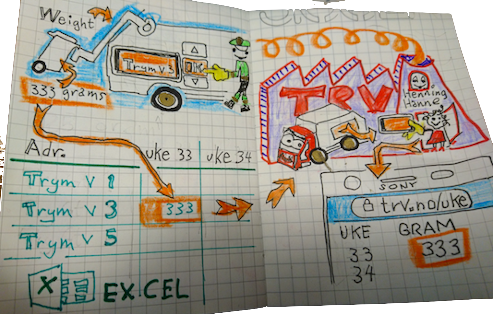

import { Button } from '../components/Button'

import { navigate } from 'gatsby'

# Add a weight scale to your junk trucks
weighYourJunk is an open source and free way to add a weight scale to your towns garbage trucks

<Button onClick={() => navigate('/setup')} kind="cancel">Get Started -> </Button>

# How weighYourJunk works
The simplest way for developers to add a weight scale, weighYourJunk handles everything for you. Weighing, address confirmation, sharing weight data between the junk truck, your excel sheet and your web site. Everything

# Easy for your junk truck driver easy for your admin

# Curious yet?
It only takes a few hours to get up and running!

<Button onClick={() => navigate('/setup')} kind="primary">Get Started -> </Button>

# These towns use weighYourJunk

- <a href="https://www.greengothenburg.se/visiting-programs/82" alt="Gothenburg">Gothenburg</a>
- <a href="https://www.aarhus.dk/english/collaborate-with-the-city/urban-development/the-environment/#1" alt="Aarhus">Aarhus</a>

